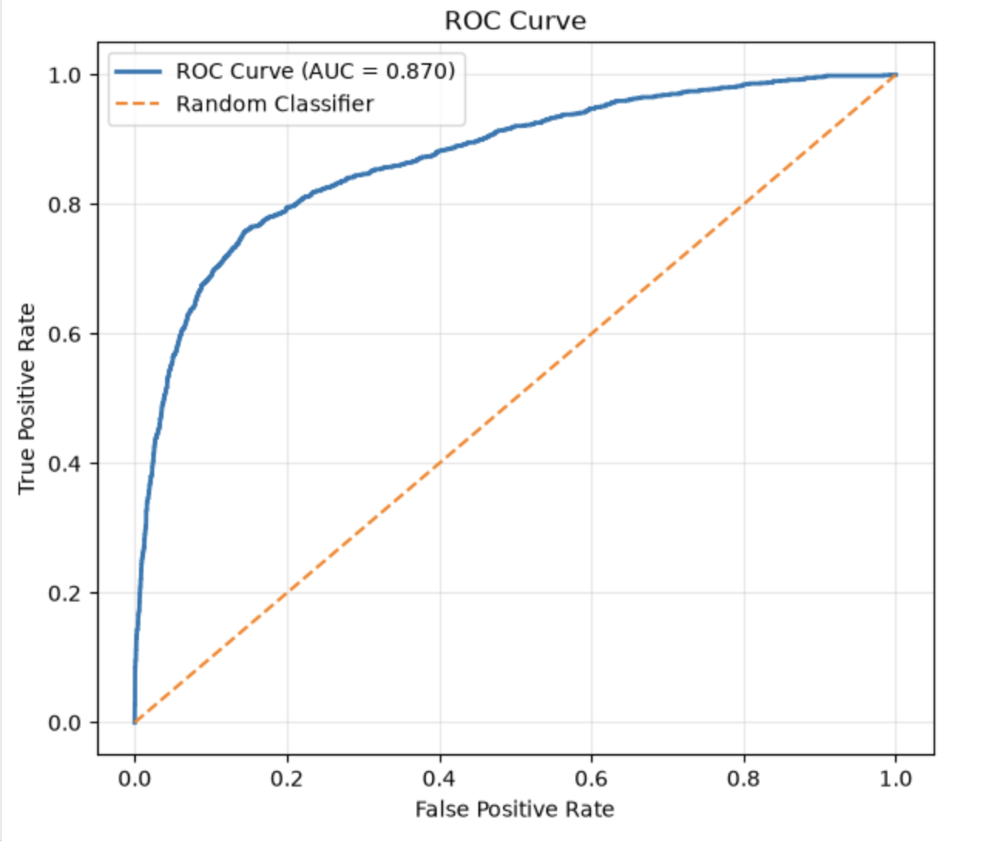
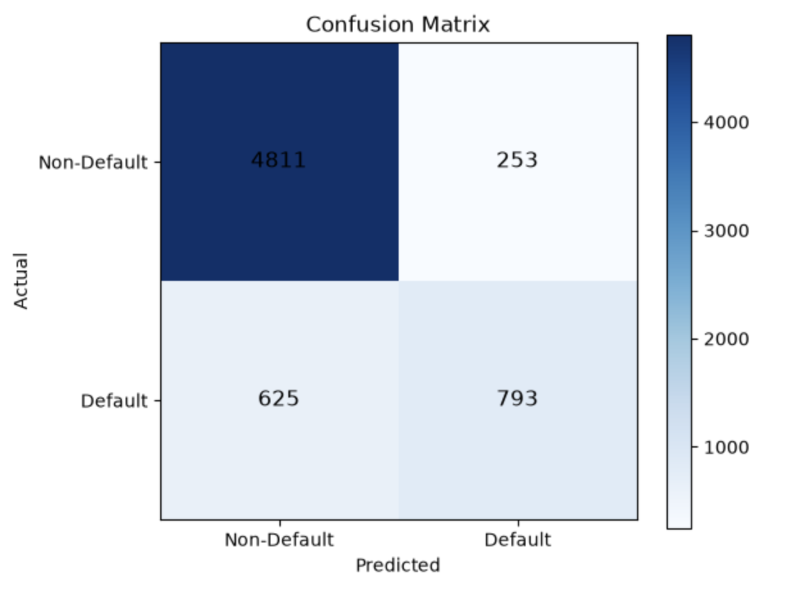
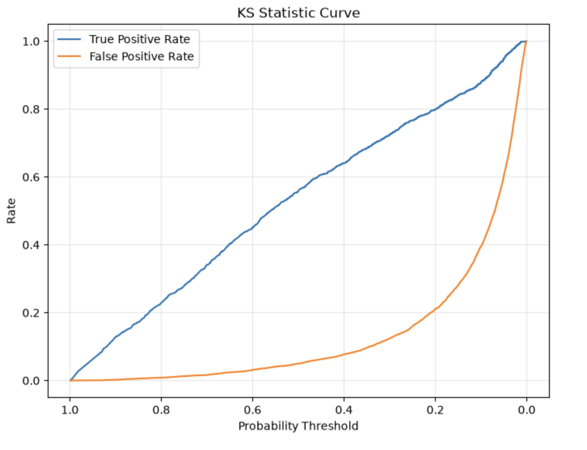

# Credit Risk Modeling & Scorecard Development

## Overview

This project develops an end-to-end Credit Risk Scorecard using Logistic Regression to estimate the Probability of Default (PD) for loan applicants.

The notebook demonstrates the complete credit risk modeling workflow used in banking and fintech organizations, including data preprocessing, exploratory data analysis, feature engineering, model development, and performance evaluation.

---

## Project Workflow

- Data Quality Assessment
- Missing Value Treatment
- Duplicate Removal
- Invalid Record Handling
- Exploratory Data Analysis (EDA)
- Business Insights
- Feature Engineering
- One-Hot Encoding
- Train-Test Split
- Logistic Regression Model
- Probability of Default Prediction
- Model Evaluation
- ROC Curve
- Confusion Matrix
- KS Statistic
- Gini Coefficient
- Feature Importance
- Business Recommendations

---

## Model Performance

| Metric | Value |
|---------|------:|
| Accuracy | 86.45% |
| Precision | 75.81% |
| Recall | 55.92% |
| F1 Score | 64.37% |
| ROC-AUC | 0.8703 |
| KS Statistic | 0.6136 |
| Gini Coefficient | 0.7406 |

---

## Technologies Used

- Python
- Pandas
- NumPy
- Matplotlib
- Scikit-learn
- Jupyter Notebook

---

## Key Business Insights

- Loan Grade showed a strong relationship with default probability.
- Previous Default History was one of the strongest predictors of future default.
- Home Ownership and Loan Purpose significantly influenced borrower risk.
- Interest Rate and Loan-to-Income Ratio contributed meaningfully to credit risk segmentation.

---

## Future Improvements

- Weight of Evidence (WOE)
- Information Value (IV)
- Scorecard Scaling (PDO)
- Risk Banding
- XGBoost / LightGBM
- Model Explainability (SHAP)

---

# 📊 Model Visualizations

## ROC Curve

---

## Confusion Matrix

---

## KS Curve

## Author

**Sheilesh Raj Tandi**

Risk Analyst | Fraud Strategy | Credit Risk Analytics | SQL | Python
